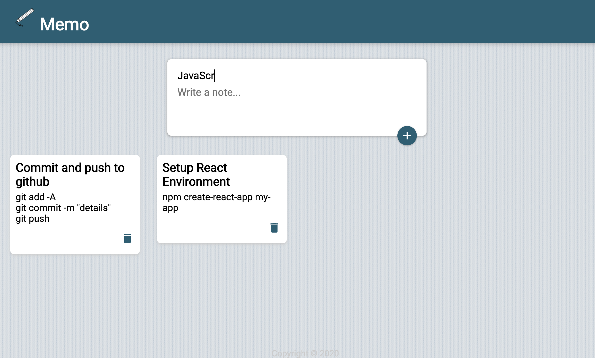

# Memo

## Description

This is a notes web web application built with REACT.

## Table of Contents

* [Description](#description)
* [Technology](#technology)
* [User Story](#user-story)
* [Installation](#installation)
* [Usage](#usage)
* [License](#license)
* [Contributing](#contributing)
* [Tests](#tests)
* [Questions](#questions)
* [Deployed Application URL](#deployed-application-URL)

## Technology
- REACT
- REACT Hooks
- Local Storage
- HTML
- CSS 
- JavaScript

## User Story

As a programmer, I want a notes application to keep notes as I learn new technologies

## Installation

No installation needed. 

## Usage

The deployed application link will take you to the homepage. From the homepage, you can type in the title of the notes and the content of the notes in the input field. Click on the plus sign to add the note to your list. Click on the garbage can icon to delete the note from your list. 

## License

## Contributing

Please follow standard contributing guidelines.

## Tests

No tests to run.

## Questions

For any questions, please contact kendayao at kendayao@gmail.com

## Deployed Application URL

Deployed application link: https://kendayao.github.io/Memo/

